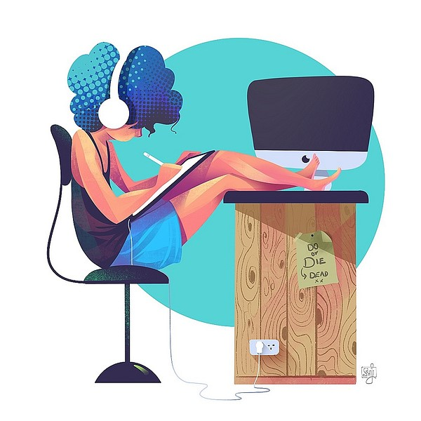

 
 
<h1 align="center", style="font-size:2.5em;">Hi 👋, I'm Chirag Bhatia</h1>
<h3 align="center"  style="font-size:2em;">A passionate Android Developer from India</h3>

 
 

<ul>
  <li style="font-size: 16px;">🔭 I’m currently <b>Pursuing a Bachelor of Computer Application (BCA)</b></li>
   
  <li style="font-size: 16px;">🌱 I’m currently learning <b>Android using Kotlin</b></li>
   
  <li style="font-size: 16px;">💬 Ask me about <b>Flutter</b></li>
   
  <li style="font-size: 16px;">📫 How to reach me <b>bhatiachirag2002@gmail.com</b></li>
</ul>

 

<h3 align="left" style="font-size: 20px;">Languages and Tools:</h3>

 

   
    
<h3 align="left"style="font-size: 20px;">Connect with me:</h3>

